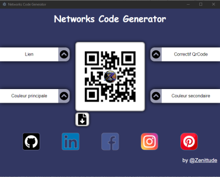

# my-app

An Electron application with React and TypeScript

## About

* When a social network url is entered, the central image is replaced by the network icon.

* The QrCode can then be downloaded as a png file

* There are 4 input fields accessible by clicking on the corresponding arrows, to modify the qrcode : 
    * social network url
    * the qrcode correction scale
    * the background color
    * the foreground color

## Screenshots

* When the application is launched



* After entering a social network address


* Downloadable image


## Recommended IDE Setup

- [VSCode](https://code.visualstudio.com/) + [ESLint](https://marketplace.visualstudio.com/items?itemName=dbaeumer.vscode-eslint) + [Prettier](https://marketplace.visualstudio.com/items?itemName=esbenp.prettier-vscode)

## Project Setup

### Install

```bash
$ npm install
```

### Development

```bash
$ npm run dev
```

### Build

```bash
# For windows
$ npm run build:win

# For macOS
$ npm run build:mac

# For Linux
$ npm run build:linux
```
